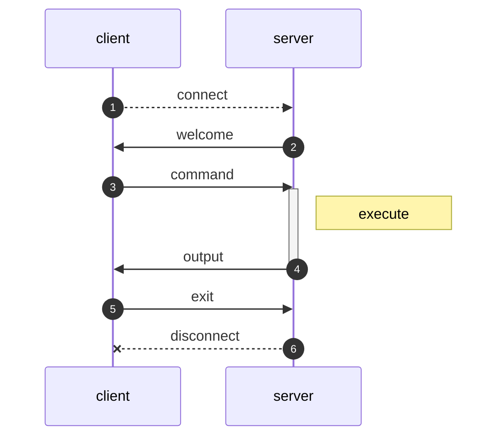

# TcpClientServerApp

[](https://github.com/iamazeem/TcpClientServerApp/actions/workflows/ci.yml)
[](./LICENSE)

Sample asynchronous protocol-based
[TCP](https://en.wikipedia.org/wiki/Transmission_Control_Protocol) client and
server apps using C++ and
[Boost::Asio](https://www.boost.org/doc/libs/1_76_0/doc/html/boost_asio.html)



## Dependencies

- C++11 or above
- [Boost::Asio](https://www.boost.org/doc/libs/1_76_0/doc/html/boost_asio.html)
- [CMake](https://cmake.org/)

## Build

```shell
git clone --recursive git@github.com:iamazeem/TcpClientServerApp.git
cd TcpClientServerApp
cmake -S . -B build
cmake --build build
```

The client and server binaries will be generated under `build` directory:

- `./build/server/server`
- `./build/client/client`

## Run

Run `server` on one terminal:

```shell
./build/server/server
```

Run `client` on another terminal:

```shell
./build/client/client
```

## License

[MIT](./LICENSE)
